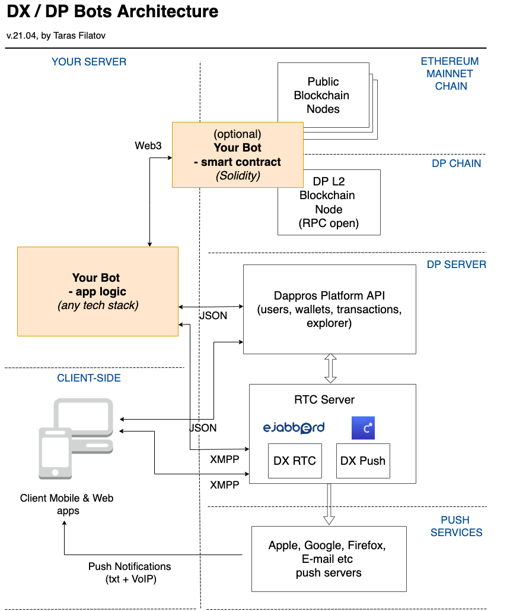

# Crypto / web3 chat bots

> **Archived historical document.** Preserved from the retired `wiki.ethora.com`.
> It describes the early Ethora engine (then the Dappros Platform) as of 2021 to 2023.
> Endpoints, class names and token standards are historical and will not match the
> current framework in [`packages/`](../packages). Kept as design reference.
> See [historical/README.md](README.md) for context.

The original concept page for bots as first-class chat participants holding wallets, assets and smart-contract logic.

**Web3 or Crypto Chat Bots** is a unique offering of our platform combining the advantages of conversational chat bots with smart contracts and distributed ledger technology.
### Features
In essence, Web3 Chat Bots are automated entities possessing the following features:
* can send and receive chat messages
* can offer both conversational and button-based UI 
* can send guidance messages visible for one or specific users only
* control one or more crypto wallets
* may have their own social profile
* can own and transfer crypto tokens (including ERC-20 Coins and NFT Items)
* may control chat rooms and/or interact with other features of Dappros Platform and Ethereum blockchain similarly as normal users do 
* often have part or most of their logic managed by a smart contract
Crypto Chat Bots allow ecosystem Owners and Users to build their own interactions and effectively extend the platform building exciting mechanisms and social economy interactions for their users. 
### Architecture

As described in the network diagram above, Bots can be hosted at your own hosting of choice and they can interact with:
* chat rooms and chat messages via **XMPP** protocol

* smart contracts and blockchain via **Web3**

* Dappros Platform via **REST JSON API**
Developers can create their own chat bots in any programming language from scratch, but the easiest thing to do is use code samples offered in our [Github repo](https://github.com/dappros/ethora). 

The requisites for the programming language of your chat bot is that it has an XMPP library so you can interact with chat server messages.

In case your bot has a Smart Contract component, it would also need to have a Web3 library. There are well known Web3.js and Web3.py libraries which correspondingly allow you to write crypto enabled chat bots in Javascript-based languages (Node.js, Typescript) as well as in Python. 
### Purposes
Crypto Chat Bots serve a multitude of purposes including:
* Social
* Trading / assets transfer
* Gaming & Entertainment 
### Examples (Bots directory)
Examples of bots available are:
#### **Welcome Bot**
* Greets the newly joining user with an informational message
* Can include buttons or other gateways to other bots present in the room
* (optional) Can send a Coins bonus for all users who join the room
* Source of funding: Welcome Bot works with the main Application wallet / Gas station 
#### **Mint Bot**
* Allows to Mint Items (NFT) by end users using their own digital assets (images, sound, video)
* Supports multiple standards (ERC-721, ERC-1155, our own NFMT standard)
* Supports private / L2 and Mainnet minting
#### **Notary Bot**
* Witnesses communications in the chat room (either all or selected discussions - depending on users instructions)
* Records a proof of communications on Ethereum blockchain using "zero knowledge proof" mechanism
* Source of funding: Notary Bot is funded by chat participants. It will notify chat participants when it runs out of funds.
#### **Prisoner Dilemma game**
* Allows two chat users to participate in a "Prisoner Dilemma" game
* The participants commit and win Coins depending on game outcome
#### **Hut, hut bot**
* This bot allows users to store "Treasure" such as ERC-20 Coins and NFT Items in a chat room
* Other users need to pay Coin to check the contents of the Hut and can collect one of the Items if anything is there
Read more about Hut, hut bot.
#### Questionnaire Bot
* Collects information from the User via a conversational interface
* Stores information in the database.
* Rewards the user for answering the questions.
### Participation
Our development team keeps working on new exciting Crypto Chat Bots, but what's even more exciting is that Crypto Chat Bots framework opens exciting opportunities for 3rd party developers to build their own interactions and worlds!
